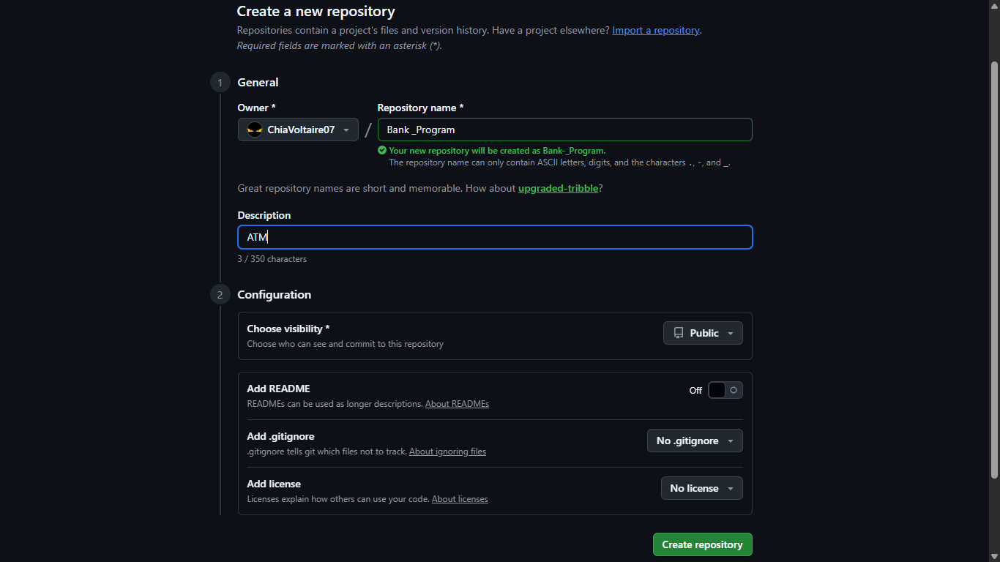

# GitHub Workflow Guide

## 1. Create a New GitHub Repository

1. Log in to GitHub.
2. Click the **New** button .
3. Enter a repository name.
4. Enter the description your repo.
5. Click **Create repository**.

**Screenshot:**  


---

## 2. Create a New Branch

1. Open your repository on GitHub.
2. Click the **main** branch dropdown.
3. Type the name of your new branch (e.g., `things`).
4. Click **Create branch**.

**Screenshot:**  


## 3. Clone the Branch to Your Machine

- Make sure Git is installed on your computer.
- To check, run:
  git --version
- If not installed, download it from git-scm.com.
- Open your terminal (Command Prompt or Git Bash).

Navigate to your desired directory.

```bash
cd desktop
```

you need to:

1.  Go to the repo on github.
2.  Click on the green code button.
3.  Copy the url of the repo.
    Then
    Do the next command:

```bash
git clone -b <branch_name> https://github.com/USERNAME/REPO.git
```

**Screenshot:**  


---

## 4. Make Changes Locally

1. **Make Sure You’re on the Correct Branch**

- Check your current branch:
  ```bash
  git branch
  ```
- The branch with `*` is the one you’re on.
- If needed, switch:
  ```bash
  git checkout branch-name
  ```

---

2. **Make Changes to Files**

- Edit or add files in your project folder.
- Example: update `index.html` or add a new file.

**Screenshot:**  


---

---

## 5. Push Changes to the Branch

1. **Stage the Changes**

- Add specific files:
  ```bash
  git add filename
  ```
- Or add all changes:
  ```bash
  git add .
  ```

---

2. **Commit the Changes**

- Save your changes with a message:
  ```bash
  git commit -m "Describe your changes here"
  ```

---

3. **Push to the Branch**

- Push your changes to the remote branch:
  ```bash
  git push origin branch-name
  ```
- `origin` is the default name of the remote repository.
- `branch-name` is the branch you’re working on (e.g., `things`).

---

### 6. **Verify the Push**

- Go to GitHub branch.
- Or run:
  ```bash
  git log
  ```
  to see your commit history locally.

---

**Screenshot:**  


---

## 6. Pull Updates From the Branch

If someone else updated the branch, or you want to sync:

```bash
git pull origin <branch_name>
```

**Screenshot:**

